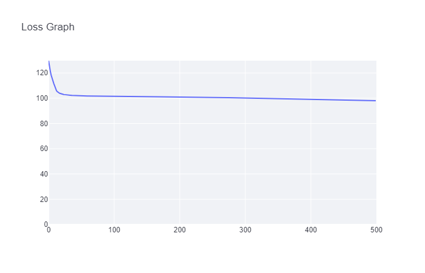

[](https://classroom.github.com/online_ide?assignment_repo_id=13787324&assignment_repo_type=AssignmentRepo)
# MiniTorch Module 2


* Docs: https://minitorch.github.io/

* Overview: https://minitorch.github.io/module2.html

This assignment requires the following files from the previous assignments.

        minitorch/operators.py minitorch/module.py minitorch/autodiff.py minitorch/scalar.py minitorch/module.py project/run_manual.py project/run_scalar.py

# Task 2-5
## Simple
PTS = 150, HIDDEN = 4, RATE = 0.5


```
Epoch: 0/500, loss: 0, correct: 0
Epoch: 10/500, loss: 129.08935332359692, correct: 71
Epoch: 20/500, loss: 114.09189240628385, correct: 71
Epoch: 30/500, loss: 110.43544466873443, correct: 71
Epoch: 40/500, loss: 108.51380703783414, correct: 71
Epoch: 50/500, loss: 107.26132451809333, correct: 71
Epoch: 60/500, loss: 106.39382170262625, correct: 71
Epoch: 70/500, loss: 105.75853945895358, correct: 71
Epoch: 80/500, loss: 105.2643371841307, correct: 71
Epoch: 90/500, loss: 104.82368215257847, correct: 71
Epoch: 100/500, loss: 104.30738139007222, correct: 65
Epoch: 110/500, loss: 103.61282610496214, correct: 65
Epoch: 120/500, loss: 102.05864341948963, correct: 88
Epoch: 130/500, loss: 100.6635905573213, correct: 90
Epoch: 140/500, loss: 99.16732071255747, correct: 97
Epoch: 150/500, loss: 97.65560530224127, correct: 108
Epoch: 160/500, loss: 96.07817601167558, correct: 113
Epoch: 170/500, loss: 94.42185105393692, correct: 117
Epoch: 180/500, loss: 91.64190078973736, correct: 118
Epoch: 190/500, loss: 89.02676547519278, correct: 123
Epoch: 200/500, loss: 86.33164696117596, correct: 125
Epoch: 210/500, loss: 83.51173603435969, correct: 127
Epoch: 220/500, loss: 80.57761356295148, correct: 128
Epoch: 230/500, loss: 77.56560184405376, correct: 129
Epoch: 240/500, loss: 74.51548178076659, correct: 131
Epoch: 250/500, loss: 71.40221349339949, correct: 132
Epoch: 260/500, loss: 68.22630897315273, correct: 134
Epoch: 270/500, loss: 65.0619990851643, correct: 136
Epoch: 280/500, loss: 61.918776187978054, correct: 138
Epoch: 290/500, loss: 58.79722849391388, correct: 142
Epoch: 300/500, loss: 55.72071466107478, correct: 143
Epoch: 310/500, loss: 52.736941094058075, correct: 146
Epoch: 320/500, loss: 49.872740618610806, correct: 146
Epoch: 330/500, loss: 47.136694649834865, correct: 146
Epoch: 340/500, loss: 44.54680581748118, correct: 146
Epoch: 350/500, loss: 42.11401535697891, correct: 146
Epoch: 360/500, loss: 39.84469552764323, correct: 146
Epoch: 370/500, loss: 37.74179582018651, correct: 147
Epoch: 380/500, loss: 35.80974161710571, correct: 148
Epoch: 390/500, loss: 34.031254699165665, correct: 147
Epoch: 400/500, loss: 32.395826412014095, correct: 148
Epoch: 410/500, loss: 30.893116159812422, correct: 148
Epoch: 420/500, loss: 29.516710472244934, correct: 148
Epoch: 430/500, loss: 28.25418506284372, correct: 147
Epoch: 440/500, loss: 27.0932693367337, correct: 147
Epoch: 450/500, loss: 26.024141147117817, correct: 147
Epoch: 460/500, loss: 25.041312178825226, correct: 147
Epoch: 470/500, loss: 24.13689618373122, correct: 146
Epoch: 480/500, loss: 23.299300810793618, correct: 146
Epoch: 490/500, loss: 22.52246980221557, correct: 146
Epoch: 500/500, loss: 21.800339224990022, correct: 146
```

## Diag
PTS = 150, HIDDEN = 4, RATE = 0.5


```
Epoch: 0/500, loss: 0, correct: 0
Epoch: 10/500, loss: 56.119037784103, correct: 129
Epoch: 20/500, loss: 52.648526337239915, correct: 129
Epoch: 30/500, loss: 51.18053667399363, correct: 129
Epoch: 40/500, loss: 50.27616700396504, correct: 129
Epoch: 50/500, loss: 49.567836017001355, correct: 129
Epoch: 60/500, loss: 48.90270404511646, correct: 129
Epoch: 70/500, loss: 48.25233486874759, correct: 129
Epoch: 80/500, loss: 47.60842531057941, correct: 129
Epoch: 90/500, loss: 46.96114536111179, correct: 129
Epoch: 100/500, loss: 46.30678425833169, correct: 129
Epoch: 110/500, loss: 45.641642065694775, correct: 129
Epoch: 120/500, loss: 44.96637577854357, correct: 129
Epoch: 130/500, loss: 44.27946089863877, correct: 129
Epoch: 140/500, loss: 43.578435570074944, correct: 129
Epoch: 150/500, loss: 42.86002190394922, correct: 129
Epoch: 160/500, loss: 42.12924365053413, correct: 129
Epoch: 170/500, loss: 41.38287212473044, correct: 129
Epoch: 180/500, loss: 40.62277958648443, correct: 129
Epoch: 190/500, loss: 39.853817084182346, correct: 129
Epoch: 200/500, loss: 39.07541626811367, correct: 129
Epoch: 210/500, loss: 38.28057721262084, correct: 129
Epoch: 220/500, loss: 37.47312521659603, correct: 129
Epoch: 230/500, loss: 36.65457867326995, correct: 129
Epoch: 240/500, loss: 35.82163442842323, correct: 129
Epoch: 250/500, loss: 34.98025420396443, correct: 129
Epoch: 260/500, loss: 34.11093104719979, correct: 129
Epoch: 270/500, loss: 33.23135721623163, correct: 129
Epoch: 280/500, loss: 32.35541821884093, correct: 131
Epoch: 290/500, loss: 31.46691526665459, correct: 131
Epoch: 300/500, loss: 30.572793739736646, correct: 133
Epoch: 310/500, loss: 29.697533754698487, correct: 134
Epoch: 320/500, loss: 28.821278878558473, correct: 134
Epoch: 330/500, loss: 27.97184608302925, correct: 134
Epoch: 340/500, loss: 27.149339848769795, correct: 135
Epoch: 350/500, loss: 26.34648990866829, correct: 135
Epoch: 360/500, loss: 25.56991649499284, correct: 135
Epoch: 370/500, loss: 24.825334883296147, correct: 136
Epoch: 380/500, loss: 24.103037448949614, correct: 138
Epoch: 390/500, loss: 23.403503934856943, correct: 140
Epoch: 400/500, loss: 22.72723586924783, correct: 141
Epoch: 410/500, loss: 22.074718325813258, correct: 141
Epoch: 420/500, loss: 21.446289013608393, correct: 141
Epoch: 430/500, loss: 20.842059598742267, correct: 142
Epoch: 440/500, loss: 20.26561362188128, correct: 142
Epoch: 450/500, loss: 19.713491673618396, correct: 142
Epoch: 460/500, loss: 19.1843466001541, correct: 142
Epoch: 470/500, loss: 18.67762975625115, correct: 143
Epoch: 480/500, loss: 18.192869525745458, correct: 146
Epoch: 490/500, loss: 17.729192412917353, correct: 146
Epoch: 500/500, loss: 17.285960865418502, correct: 146
```

## Split
PTS = 150, HIDDEN = 4, RATE = 0.5

```
Epoch: 0/500, loss: 0, correct: 0
Epoch: 10/500, loss: 105.40956806695668, correct: 82
Epoch: 20/500, loss: 105.16311977665919, correct: 77
Epoch: 30/500, loss: 105.0358300131099, correct: 74
Epoch: 40/500, loss: 104.95398700149673, correct: 73
Epoch: 50/500, loss: 104.89481482035535, correct: 73
Epoch: 60/500, loss: 104.84504207500366, correct: 73
Epoch: 70/500, loss: 104.79972409122652, correct: 72
Epoch: 80/500, loss: 104.75396865967625, correct: 72
Epoch: 90/500, loss: 104.71048725100809, correct: 72
Epoch: 100/500, loss: 104.67080217413678, correct: 72
Epoch: 110/500, loss: 104.63259713965485, correct: 72
Epoch: 120/500, loss: 104.59375666925584, correct: 72
Epoch: 130/500, loss: 104.55585767889825, correct: 72
Epoch: 140/500, loss: 104.52433422140477, correct: 72
Epoch: 150/500, loss: 104.49319208765563, correct: 72
Epoch: 160/500, loss: 104.46285701189619, correct: 72
Epoch: 170/500, loss: 104.43408621776575, correct: 72
Epoch: 180/500, loss: 104.40848477159437, correct: 73
Epoch: 190/500, loss: 104.38365073874444, correct: 74
Epoch: 200/500, loss: 104.35909308884713, correct: 74
Epoch: 210/500, loss: 104.33432688684658, correct: 73
Epoch: 220/500, loss: 104.31121792003513, correct: 74
Epoch: 230/500, loss: 104.28894260939825, correct: 74
Epoch: 240/500, loss: 104.26810375377413, correct: 74
Epoch: 250/500, loss: 104.2465353220808, correct: 75
Epoch: 260/500, loss: 104.22394025051658, correct: 75
Epoch: 270/500, loss: 104.20175872057037, correct: 75
Epoch: 280/500, loss: 104.18100673407336, correct: 77
Epoch: 290/500, loss: 104.15987100243383, correct: 77
Epoch: 300/500, loss: 104.13818414814992, correct: 77
Epoch: 310/500, loss: 104.11663697207553, correct: 77
Epoch: 320/500, loss: 104.09434774635291, correct: 78
Epoch: 330/500, loss: 104.06665426516868, correct: 78
Epoch: 340/500, loss: 104.03027258686207, correct: 78
Epoch: 350/500, loss: 103.98594111920323, correct: 79
Epoch: 360/500, loss: 103.94740283653357, correct: 79
Epoch: 370/500, loss: 103.90480104288568, correct: 79
Epoch: 380/500, loss: 103.86236353474646, correct: 81
Epoch: 390/500, loss: 103.8206408533459, correct: 81
Epoch: 400/500, loss: 103.75241333412129, correct: 81
Epoch: 410/500, loss: 103.63110938448062, correct: 82
Epoch: 420/500, loss: 103.52996695460521, correct: 84
Epoch: 430/500, loss: 103.47187029948928, correct: 83
Epoch: 440/500, loss: 103.42782647732716, correct: 83
Epoch: 450/500, loss: 103.38783502819425, correct: 83
Epoch: 460/500, loss: 103.34956202837746, correct: 83
Epoch: 470/500, loss: 103.3134220690924, correct: 83
Epoch: 480/500, loss: 103.27849663120747, correct: 84
Epoch: 490/500, loss: 103.2434219712971, correct: 84
Epoch: 500/500, loss: 103.20812583678166, correct: 85
```

## Xor
PTS = 150, HIDDEN = 4, RATE = 0.5


```
Epoch: 0/500, loss: 0, correct: 0
Epoch: 10/500, loss: 114.18948340149596, correct: 77
Epoch: 20/500, loss: 107.66512386822835, correct: 77
Epoch: 30/500, loss: 105.21969565669846, correct: 77
Epoch: 40/500, loss: 104.35751747660193, correct: 77
Epoch: 50/500, loss: 104.06418340921086, correct: 77
Epoch: 60/500, loss: 103.96636981660139, correct: 77
Epoch: 70/500, loss: 103.93411906630276, correct: 77
Epoch: 80/500, loss: 103.92355269566458, correct: 77
Epoch: 90/500, loss: 103.92010320046914, correct: 77
Epoch: 100/500, loss: 103.9189793642636, correct: 77
Epoch: 110/500, loss: 103.91861364379056, correct: 77
Epoch: 120/500, loss: 103.91849470859933, correct: 77
Epoch: 130/500, loss: 103.91845604439148, correct: 77
Epoch: 140/500, loss: 103.91844347786108, correct: 77
Epoch: 150/500, loss: 103.91843939401956, correct: 77
Epoch: 160/500, loss: 103.91843806695358, correct: 77
Epoch: 170/500, loss: 103.91843763573345, correct: 77
Epoch: 180/500, loss: 103.91843749561505, correct: 77
Epoch: 190/500, loss: 103.91843745008647, correct: 77
Epoch: 200/500, loss: 103.91843743529286, correct: 77
Epoch: 210/500, loss: 103.91843743048595, correct: 77
Epoch: 220/500, loss: 103.9184374289238, correct: 77
Epoch: 230/500, loss: 103.91843742841644, correct: 77
Epoch: 240/500, loss: 103.91843742825168, correct: 77
Epoch: 250/500, loss: 103.91843742819813, correct: 77
Epoch: 260/500, loss: 103.91843742818051, correct: 77
Epoch: 270/500, loss: 103.91843742817481, correct: 77
Epoch: 280/500, loss: 103.91843742817298, correct: 77
Epoch: 290/500, loss: 103.9184374281723, correct: 77
Epoch: 300/500, loss: 103.91843742817215, correct: 77
Epoch: 310/500, loss: 103.91843742817211, correct: 77
Epoch: 320/500, loss: 103.91843742817197, correct: 77
Epoch: 330/500, loss: 103.91843742817223, correct: 77
Epoch: 340/500, loss: 103.91843742817234, correct: 77
Epoch: 350/500, loss: 103.91843742817201, correct: 77
Epoch: 360/500, loss: 103.91843742817211, correct: 77
Epoch: 370/500, loss: 103.91843742817227, correct: 77
Epoch: 380/500, loss: 103.91843742817197, correct: 77
Epoch: 390/500, loss: 103.91843742817218, correct: 77
Epoch: 400/500, loss: 103.91843742817214, correct: 77
Epoch: 410/500, loss: 103.9184374281724, correct: 77
Epoch: 420/500, loss: 103.91843742817228, correct: 77
Epoch: 430/500, loss: 103.91843742817188, correct: 77
Epoch: 440/500, loss: 103.91843742817245, correct: 77
Epoch: 450/500, loss: 103.91843742817213, correct: 77
Epoch: 460/500, loss: 103.91843742817206, correct: 77
Epoch: 470/500, loss: 103.91843742817207, correct: 77
Epoch: 480/500, loss: 103.91843742817235, correct: 77
Epoch: 490/500, loss: 103.91843742817218, correct: 77
Epoch: 500/500, loss: 103.91843742817223, correct: 77
```
