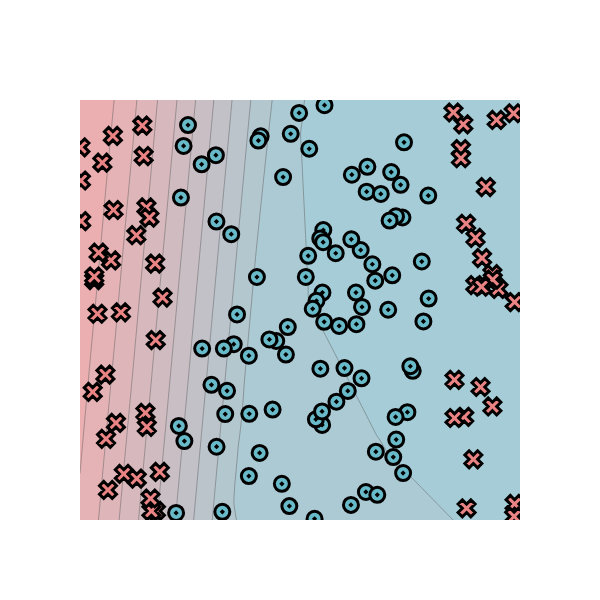

[](https://classroom.github.com/online_ide?assignment_repo_id=13787324&assignment_repo_type=AssignmentRepo)
# MiniTorch Module 2


* Docs: https://minitorch.github.io/

* Overview: https://minitorch.github.io/module2.html

This assignment requires the following files from the previous assignments.

        minitorch/operators.py minitorch/module.py minitorch/autodiff.py minitorch/scalar.py minitorch/module.py project/run_manual.py project/run_scalar.py

# Task 2-5
## Simple
PTS = 150, HIDDEN = 4, RATE = 0.5


```
Epoch: 0/500, loss: 0, correct: 0
Epoch: 10/500, loss: 129.08935332359692, correct: 71
Epoch: 20/500, loss: 114.09189240628385, correct: 71
Epoch: 30/500, loss: 110.43544466873443, correct: 71
Epoch: 40/500, loss: 108.51380703783414, correct: 71
Epoch: 50/500, loss: 107.26132451809333, correct: 71
Epoch: 60/500, loss: 106.39382170262625, correct: 71
Epoch: 70/500, loss: 105.75853945895358, correct: 71
Epoch: 80/500, loss: 105.2643371841307, correct: 71
Epoch: 90/500, loss: 104.82368215257847, correct: 71
Epoch: 100/500, loss: 104.30738139007222, correct: 65
Epoch: 110/500, loss: 103.61282610496214, correct: 65
Epoch: 120/500, loss: 102.05864341948963, correct: 88
Epoch: 130/500, loss: 100.6635905573213, correct: 90
Epoch: 140/500, loss: 99.16732071255747, correct: 97
Epoch: 150/500, loss: 97.65560530224127, correct: 108
Epoch: 160/500, loss: 96.07817601167558, correct: 113
Epoch: 170/500, loss: 94.42185105393692, correct: 117
Epoch: 180/500, loss: 91.64190078973736, correct: 118
Epoch: 190/500, loss: 89.02676547519278, correct: 123
Epoch: 200/500, loss: 86.33164696117596, correct: 125
Epoch: 210/500, loss: 83.51173603435969, correct: 127
Epoch: 220/500, loss: 80.57761356295148, correct: 128
Epoch: 230/500, loss: 77.56560184405376, correct: 129
Epoch: 240/500, loss: 74.51548178076659, correct: 131
Epoch: 250/500, loss: 71.40221349339949, correct: 132
Epoch: 260/500, loss: 68.22630897315273, correct: 134
Epoch: 270/500, loss: 65.0619990851643, correct: 136
Epoch: 280/500, loss: 61.918776187978054, correct: 138
Epoch: 290/500, loss: 58.79722849391388, correct: 142
Epoch: 300/500, loss: 55.72071466107478, correct: 143
Epoch: 310/500, loss: 52.736941094058075, correct: 146
Epoch: 320/500, loss: 49.872740618610806, correct: 146
Epoch: 330/500, loss: 47.136694649834865, correct: 146
Epoch: 340/500, loss: 44.54680581748118, correct: 146
Epoch: 350/500, loss: 42.11401535697891, correct: 146
Epoch: 360/500, loss: 39.84469552764323, correct: 146
Epoch: 370/500, loss: 37.74179582018651, correct: 147
Epoch: 380/500, loss: 35.80974161710571, correct: 148
Epoch: 390/500, loss: 34.031254699165665, correct: 147
Epoch: 400/500, loss: 32.395826412014095, correct: 148
Epoch: 410/500, loss: 30.893116159812422, correct: 148
Epoch: 420/500, loss: 29.516710472244934, correct: 148
Epoch: 430/500, loss: 28.25418506284372, correct: 147
Epoch: 440/500, loss: 27.0932693367337, correct: 147
Epoch: 450/500, loss: 26.024141147117817, correct: 147
Epoch: 460/500, loss: 25.041312178825226, correct: 147
Epoch: 470/500, loss: 24.13689618373122, correct: 146
Epoch: 480/500, loss: 23.299300810793618, correct: 146
Epoch: 490/500, loss: 22.52246980221557, correct: 146
Epoch: 500/500, loss: 21.800339224990022, correct: 146
```

## Diag
PTS = 150, HIDDEN = 4, RATE = 0.5


```
Epoch: 0/500, loss: 0, correct: 0
Epoch: 10/500, loss: 56.119037784103, correct: 129
Epoch: 20/500, loss: 52.648526337239915, correct: 129
Epoch: 30/500, loss: 51.18053667399363, correct: 129
Epoch: 40/500, loss: 50.27616700396504, correct: 129
Epoch: 50/500, loss: 49.567836017001355, correct: 129
Epoch: 60/500, loss: 48.90270404511646, correct: 129
Epoch: 70/500, loss: 48.25233486874759, correct: 129
Epoch: 80/500, loss: 47.60842531057941, correct: 129
Epoch: 90/500, loss: 46.96114536111179, correct: 129
Epoch: 100/500, loss: 46.30678425833169, correct: 129
Epoch: 110/500, loss: 45.641642065694775, correct: 129
Epoch: 120/500, loss: 44.96637577854357, correct: 129
Epoch: 130/500, loss: 44.27946089863877, correct: 129
Epoch: 140/500, loss: 43.578435570074944, correct: 129
Epoch: 150/500, loss: 42.86002190394922, correct: 129
Epoch: 160/500, loss: 42.12924365053413, correct: 129
Epoch: 170/500, loss: 41.38287212473044, correct: 129
Epoch: 180/500, loss: 40.62277958648443, correct: 129
Epoch: 190/500, loss: 39.853817084182346, correct: 129
Epoch: 200/500, loss: 39.07541626811367, correct: 129
Epoch: 210/500, loss: 38.28057721262084, correct: 129
Epoch: 220/500, loss: 37.47312521659603, correct: 129
Epoch: 230/500, loss: 36.65457867326995, correct: 129
Epoch: 240/500, loss: 35.82163442842323, correct: 129
Epoch: 250/500, loss: 34.98025420396443, correct: 129
Epoch: 260/500, loss: 34.11093104719979, correct: 129
Epoch: 270/500, loss: 33.23135721623163, correct: 129
Epoch: 280/500, loss: 32.35541821884093, correct: 131
Epoch: 290/500, loss: 31.46691526665459, correct: 131
Epoch: 300/500, loss: 30.572793739736646, correct: 133
Epoch: 310/500, loss: 29.697533754698487, correct: 134
Epoch: 320/500, loss: 28.821278878558473, correct: 134
Epoch: 330/500, loss: 27.97184608302925, correct: 134
Epoch: 340/500, loss: 27.149339848769795, correct: 135
Epoch: 350/500, loss: 26.34648990866829, correct: 135
Epoch: 360/500, loss: 25.56991649499284, correct: 135
Epoch: 370/500, loss: 24.825334883296147, correct: 136
Epoch: 380/500, loss: 24.103037448949614, correct: 138
Epoch: 390/500, loss: 23.403503934856943, correct: 140
Epoch: 400/500, loss: 22.72723586924783, correct: 141
Epoch: 410/500, loss: 22.074718325813258, correct: 141
Epoch: 420/500, loss: 21.446289013608393, correct: 141
Epoch: 430/500, loss: 20.842059598742267, correct: 142
Epoch: 440/500, loss: 20.26561362188128, correct: 142
Epoch: 450/500, loss: 19.713491673618396, correct: 142
Epoch: 460/500, loss: 19.1843466001541, correct: 142
Epoch: 470/500, loss: 18.67762975625115, correct: 143
Epoch: 480/500, loss: 18.192869525745458, correct: 146
Epoch: 490/500, loss: 17.729192412917353, correct: 146
Epoch: 500/500, loss: 17.285960865418502, correct: 146
```

## Split
PTS = 150, HIDDEN = 4, RATE = 0.5


```
Epoch: 0/500, loss: 0, correct: 0
Epoch: 10/500, loss: 111.52667867392988, correct: 58
Epoch: 20/500, loss: 101.25873741708465, correct: 119
Epoch: 30/500, loss: 98.3395717965641, correct: 92
Epoch: 40/500, loss: 97.42557925669496, correct: 92
Epoch: 50/500, loss: 97.08929791142359, correct: 92
Epoch: 60/500, loss: 96.8350050637598, correct: 92
Epoch: 70/500, loss: 96.59423058539409, correct: 92
Epoch: 80/500, loss: 96.34906545812032, correct: 92
Epoch: 90/500, loss: 96.10289957997813, correct: 92
Epoch: 100/500, loss: 95.84424101986326, correct: 92
Epoch: 110/500, loss: 95.58949583727698, correct: 92
Epoch: 120/500, loss: 95.32876936318844, correct: 92
Epoch: 130/500, loss: 95.05943796636899, correct: 92
Epoch: 140/500, loss: 94.78422342264645, correct: 93
Epoch: 150/500, loss: 94.50723899255476, correct: 95
Epoch: 160/500, loss: 94.22450597534127, correct: 95
Epoch: 170/500, loss: 93.9391324316373, correct: 100
Epoch: 180/500, loss: 93.64700697414804, correct: 102
Epoch: 190/500, loss: 93.3469651563991, correct: 104
Epoch: 200/500, loss: 93.0416072670887, correct: 105
Epoch: 210/500, loss: 92.72989034091306, correct: 108
Epoch: 220/500, loss: 92.41318264453852, correct: 110
Epoch: 230/500, loss: 92.0921211893013, correct: 113
Epoch: 240/500, loss: 91.76868472672507, correct: 114
Epoch: 250/500, loss: 91.44079004597793, correct: 114
Epoch: 260/500, loss: 91.10593189940471, correct: 116
Epoch: 270/500, loss: 90.76759924933465, correct: 116
Epoch: 280/500, loss: 90.42895895627998, correct: 116
Epoch: 290/500, loss: 90.08723894257103, correct: 117
Epoch: 300/500, loss: 89.7419227915818, correct: 119
Epoch: 310/500, loss: 89.39444322770568, correct: 118
Epoch: 320/500, loss: 89.04118073715604, correct: 118
Epoch: 330/500, loss: 88.68296506377422, correct: 118
Epoch: 340/500, loss: 88.32958824267476, correct: 118
Epoch: 350/500, loss: 87.9750391800167, correct: 118
Epoch: 360/500, loss: 87.61562583599726, correct: 119
Epoch: 370/500, loss: 87.25792446463507, correct: 120
Epoch: 380/500, loss: 86.90109315487645, correct: 121
Epoch: 390/500, loss: 86.5427619086892, correct: 122
Epoch: 400/500, loss: 86.18782462232568, correct: 122
Epoch: 410/500, loss: 85.83716974922862, correct: 122
Epoch: 420/500, loss: 85.48847569045888, correct: 121
Epoch: 430/500, loss: 85.13681007593394, correct: 122
Epoch: 440/500, loss: 84.7874532231181, correct: 121
Epoch: 450/500, loss: 84.44708173991353, correct: 121
Epoch: 460/500, loss: 84.1113651861201, correct: 121
Epoch: 470/500, loss: 83.78445100857445, correct: 121
Epoch: 480/500, loss: 83.46805039197984, correct: 120
Epoch: 490/500, loss: 83.15808699920379, correct: 120
Epoch: 500/500, loss: 82.85035188112373, correct: 120
```

## Xor
PTS = 150, HIDDEN = 4, RATE = 0.5


```
Epoch: 0/500, loss: 0, correct: 0
Epoch: 10/500, loss: 110.16389637775119, correct: 68
Epoch: 20/500, loss: 103.51900189524757, correct: 68
Epoch: 30/500, loss: 102.49956783783188, correct: 91
Epoch: 40/500, loss: 102.07576670781596, correct: 97
Epoch: 50/500, loss: 101.87343881697345, correct: 95
Epoch: 60/500, loss: 101.75226988277296, correct: 95
Epoch: 70/500, loss: 101.66867115313231, correct: 96
Epoch: 80/500, loss: 101.60028239284314, correct: 96
Epoch: 90/500, loss: 101.53986380177402, correct: 96
Epoch: 100/500, loss: 101.48137391738992, correct: 96
Epoch: 110/500, loss: 101.42279629324322, correct: 96
Epoch: 120/500, loss: 101.36441548649196, correct: 96
Epoch: 130/500, loss: 101.30632796473334, correct: 96
Epoch: 140/500, loss: 101.24725468366965, correct: 96
Epoch: 150/500, loss: 101.18861593007753, correct: 96
Epoch: 160/500, loss: 101.13255487982315, correct: 96
Epoch: 170/500, loss: 101.07594145560257, correct: 96
Epoch: 180/500, loss: 101.01778262773756, correct: 96
Epoch: 190/500, loss: 100.95878557564815, correct: 96
Epoch: 200/500, loss: 100.89976316409467, correct: 96
Epoch: 210/500, loss: 100.83993071282929, correct: 96
Epoch: 220/500, loss: 100.77954486592974, correct: 95
Epoch: 230/500, loss: 100.71780883384162, correct: 94
Epoch: 240/500, loss: 100.65436311546098, correct: 94
Epoch: 250/500, loss: 100.58920448216355, correct: 94
Epoch: 260/500, loss: 100.52222873747564, correct: 94
Epoch: 270/500, loss: 100.45279655480843, correct: 94
Epoch: 280/500, loss: 100.38099068004705, correct: 94
Epoch: 290/500, loss: 100.3058791350147, correct: 94
Epoch: 300/500, loss: 100.22852783943482, correct: 94
Epoch: 310/500, loss: 100.14885965841994, correct: 94
Epoch: 320/500, loss: 100.06747360454374, correct: 94
Epoch: 330/500, loss: 99.98408399170891, correct: 94
Epoch: 340/500, loss: 99.89846759465814, correct: 94
Epoch: 350/500, loss: 99.80970115959549, correct: 94
Epoch: 360/500, loss: 99.71821492737875, correct: 94
Epoch: 370/500, loss: 99.6232451652893, correct: 94
Epoch: 380/500, loss: 99.52323843738458, correct: 94
Epoch: 390/500, loss: 99.41973258956688, correct: 94
Epoch: 400/500, loss: 99.31249499545362, correct: 94
Epoch: 410/500, loss: 99.20132661562752, correct: 94
Epoch: 420/500, loss: 99.0873215907137, correct: 94
Epoch: 430/500, loss: 98.96992772624732, correct: 94
Epoch: 440/500, loss: 98.84827137432382, correct: 94
Epoch: 450/500, loss: 98.72212491310468, correct: 94
Epoch: 460/500, loss: 98.59133273580862, correct: 94
Epoch: 470/500, loss: 98.45598990946287, correct: 95
Epoch: 480/500, loss: 98.31605996092591, correct: 95
Epoch: 490/500, loss: 98.16792236441015, correct: 95
Epoch: 500/500, loss: 98.01640580602401, correct: 95
```
